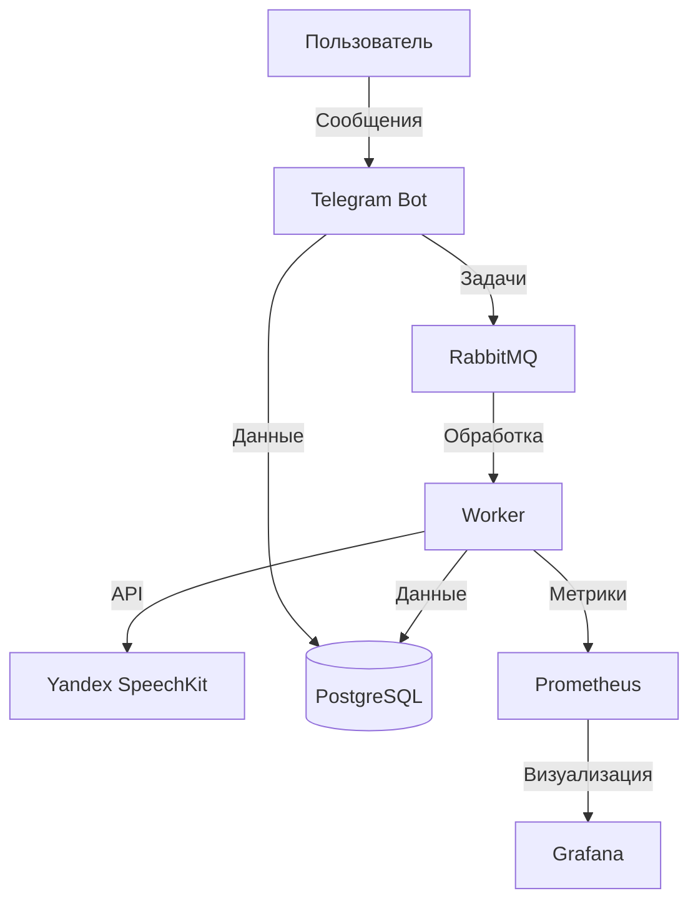
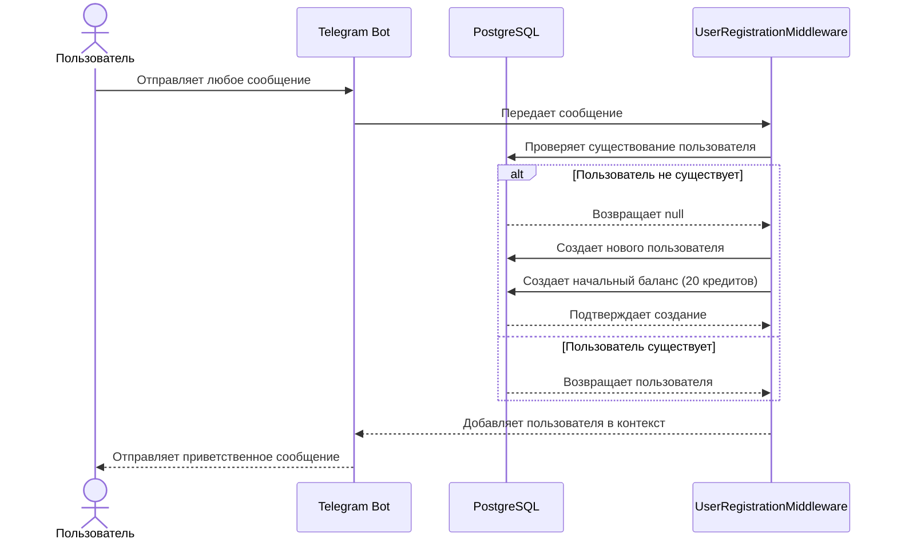
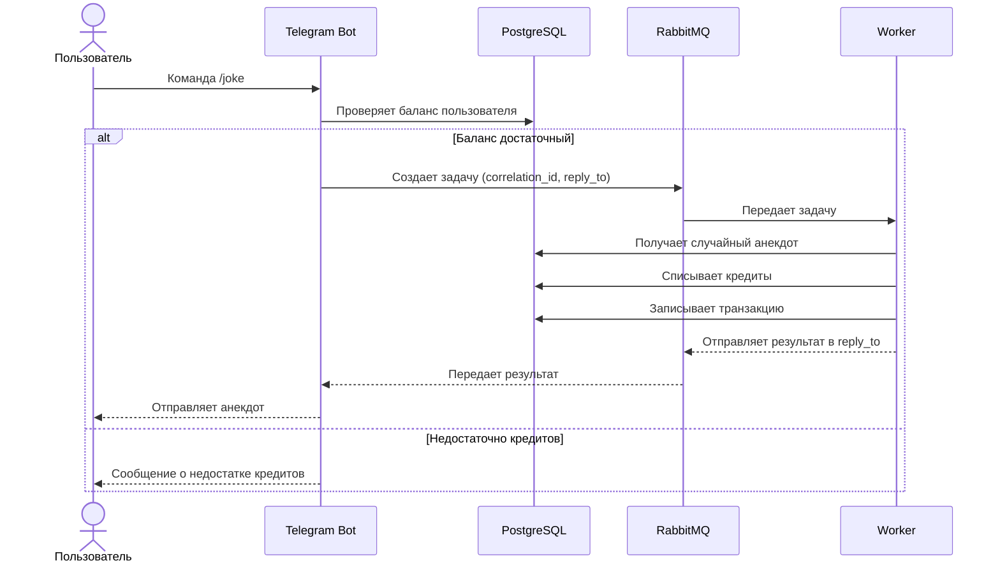
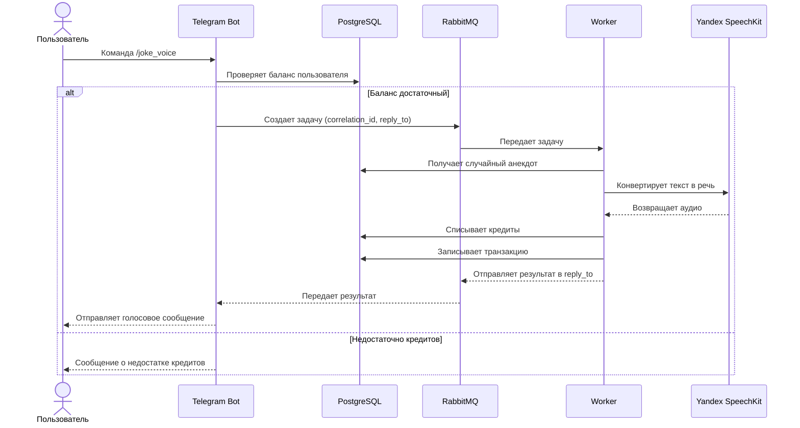
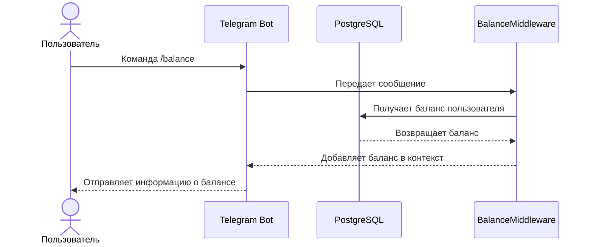
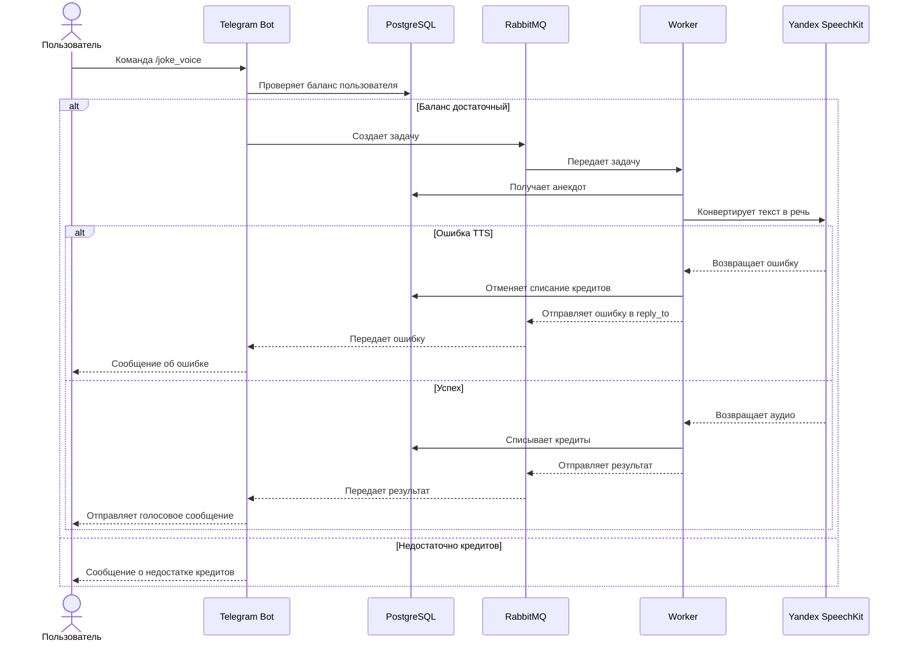

# 📚 Техническая документация

## 🏗️ Общая архитектура



## 🏗️ Архитектура

Проект построен на микросервисной архитектуре и состоит из следующих компонентов:

### 1. Telegram Bot (`/bot`)
- Обработка команд пользователей
- Взаимодействие с базой данных
- Отправка задач в очередь
- Получение результатов от воркера
- Управление балансом пользователей

### 2. Worker (`/worker`)
- Асинхронная обработка задач
- Преобразование текста в речь (TTS)
- Преобразование речи в текст (STT)
- Взаимодействие с базой данных
- Отправка результатов в очередь ответов

### 3. База данных (`/db`)
- PostgreSQL для хранения данных
- Миграции через Alembic
- Модели данных в `/models`
- Основные таблицы:
  - `users` - информация о пользователях
  - `balances` - балансы пользователей
  - `jokes` - коллекция анекдотов
  - `tasks` - история задач
  - `transactions` - история транзакций

### 4. AI Сервисы (`/ai_studio`)
- Интеграция с Yandex SpeechKit
- TTS (Text-to-Speech):
  - Преобразование текста анекдотов в речь
  - Настройка голоса и параметров
- STT (Speech-to-Text):
  - Распознавание голосовых сообщений
  - Обработка аудио

### 5. Мониторинг (`/monitoring`)
- Prometheus для сбора метрик
- Grafana для визуализации
- Дашборды для отслеживания:
  - Количества запросов
  - Времени обработки
  - Ошибок
  - Баланса пользователей

## 🔧 Технический стек

### Языки и фреймворки
- Python 3.11+
- aiogram 3.x (Telegram Bot Framework)
- SQLAlchemy (ORM)
- Alembic (миграции)
- aio-pika (RabbitMQ клиент)
- Yandex SpeechKit SDK

### База данных
- PostgreSQL 15
- Асинхронные драйверы
- Пул соединений
- Транзакции
- Схема базы данных:
  ```sql
  -- Пользователи
  CREATE TABLE users (
      telegram_id BIGINT PRIMARY KEY,
      username TEXT,
      role TEXT DEFAULT 'CHILL_BOY',
      created_at TIMESTAMP DEFAULT CURRENT_TIMESTAMP
  );

  -- Балансы
  CREATE TABLE balances (
      user_id BIGINT PRIMARY KEY REFERENCES users(telegram_id),
      balance INTEGER DEFAULT 20,
      updated_at TIMESTAMP DEFAULT CURRENT_TIMESTAMP
  );

  -- Анекдоты
  CREATE TABLE jokes (
      id SERIAL PRIMARY KEY,
      text TEXT NOT NULL,
      category TEXT,
      created_at TIMESTAMP DEFAULT CURRENT_TIMESTAMP
  );

  -- Задачи
  CREATE TABLE tasks (
      id TEXT PRIMARY KEY,
      user_id BIGINT REFERENCES users(telegram_id),
      type TEXT NOT NULL,
      status TEXT NOT NULL,
      payload TEXT,
      result TEXT,
      cost INTEGER,
      created_at TIMESTAMP DEFAULT CURRENT_TIMESTAMP,
      finished_at TIMESTAMP
  );

  -- Транзакции
  CREATE TABLE transactions (
      id SERIAL PRIMARY KEY,
      user_id BIGINT REFERENCES users(telegram_id),
      type TEXT NOT NULL,
      amount INTEGER NOT NULL,
      reason TEXT,
      task_id TEXT,
      created_at TIMESTAMP DEFAULT CURRENT_TIMESTAMP
  );
  ```

### Очереди сообщений
- RabbitMQ
- Очереди:
  - `tasks` - для задач
  - `reply_to` - для ответов

### Контейнеризация
- Docker
- Docker Compose
- Многоэтапные сборки
- Оптимизированные образы

## 📁 Структура проекта

```
python_ml_billing_service/
├── alembic/              # Миграции базы данных
│   ├── versions/        # Файлы миграций
│   └── env.py          # Конфигурация Alembic
│
├── bot/                 # Telegram бот
│   ├── middleware/     # Middleware компоненты
│   ├── routers/       # Обработчики команд
│   └── bot.py         # Основной файл бота
│
├── worker/             # Обработчик задач
│   ├── services/      # Сервисы воркера
│   └── worker.py      # Основной файл воркера
│
├── db/                # Работа с БД
│   └── database.py    # Класс для работы с БД
│
├── models/            # Модели данных
│   ├── user.py       # Модель пользователя
│   ├── balance.py    # Модель баланса
│   ├── task.py       # Модель задачи
│   ├── joke.py       # Модель анекдота
│   └── base.py       # Базовая модель
│
├── services/          # Бизнес-логика
│   ├── bot_service.py
│   ├── billing_service.py
│   └── joke_service.py
│
├── ai_studio/         # AI сервисы
│   ├── tts.py        # Text-to-Speech
│   └── stt.py        # Speech-to-Text
│
├── utils/             # Утилиты
│   ├── file_utils.py
│   └── utils.py
│
├── monitoring/        # Мониторинг
│   ├── prometheus.yml
│   └── grafana/
│
├── docker-compose.yml # Конфигурация Docker
├── Dockerfile        # Сборка образа
└── requirements.txt  # Зависимости
```

## 🔄 Процесс обработки запроса

1. **Получение команды**
   - Пользователь отправляет команду боту
   - Middleware регистрирует пользователя
   - Проверяется баланс

2. **Создание задачи**
   - Генерируется уникальный ID задачи
   - Задача записывается в БД
   - Задача отправляется в очередь

3. **Обработка воркером**
   - Воркер получает задачу
   - Выполняет необходимые операции
   - Обновляет статус в БД
   - Отправляет результат в очередь ответов

4. **Отправка результата**
   - Бот получает результат
   - Обновляет баланс пользователя
   - Отправляет ответ пользователю

## 📊 Мониторинг

### Prometheus метрики
- `bot_requests_total` - количество запросов
- `bot_processing_time` - время обработки
- `bot_errors_total` - количество ошибок
- `user_balance` - баланс пользователей

### Grafana дашборды
- Общая статистика
- Графики ошибок
- Мониторинг очередей
- Статистика пользователей

## 🔐 Безопасность

- Проверка баланса перед операциями
- Валидация входных данных
- Безопасное хранение токенов
- Логирование действий
- Защита от спама

## 🚀 Масштабирование

- Горизонтальное масштабирование воркеров
- Пул соединений с БД
- Асинхронная обработка
- Кэширование результатов

## 📝 Логирование

- Логи в stdout
- Запись в БД
- Метрики в Prometheus
- Трейсинг операций

## 🔄 Диаграммы последовательности

### Регистрация пользователя


### Получение анекдота


### Получение голосового анекдота


### Проверка баланса


### Обработка ошибок

