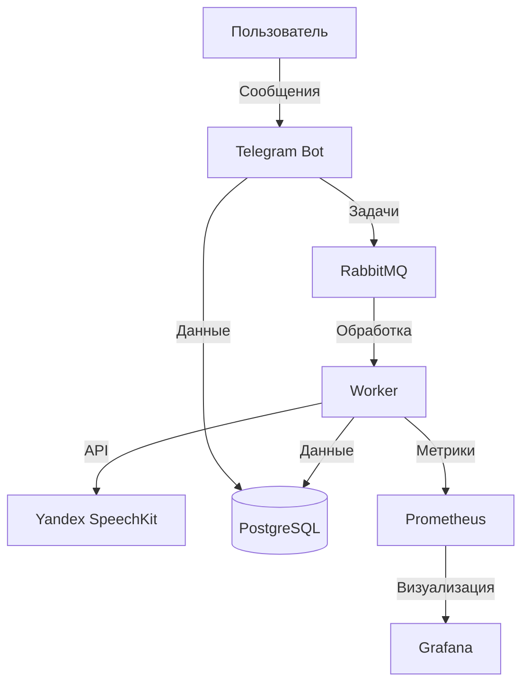
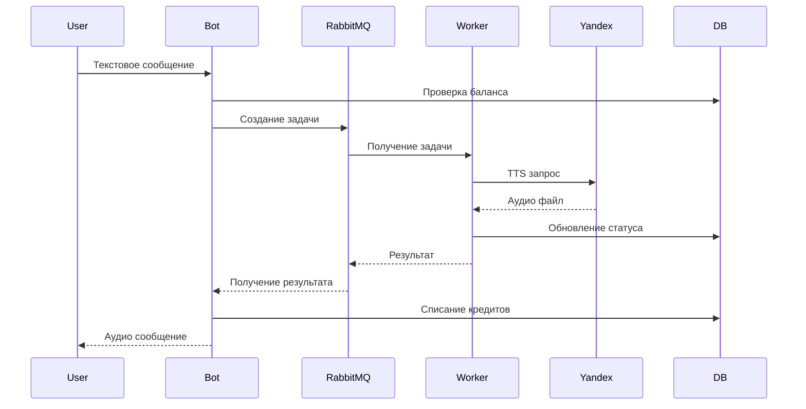
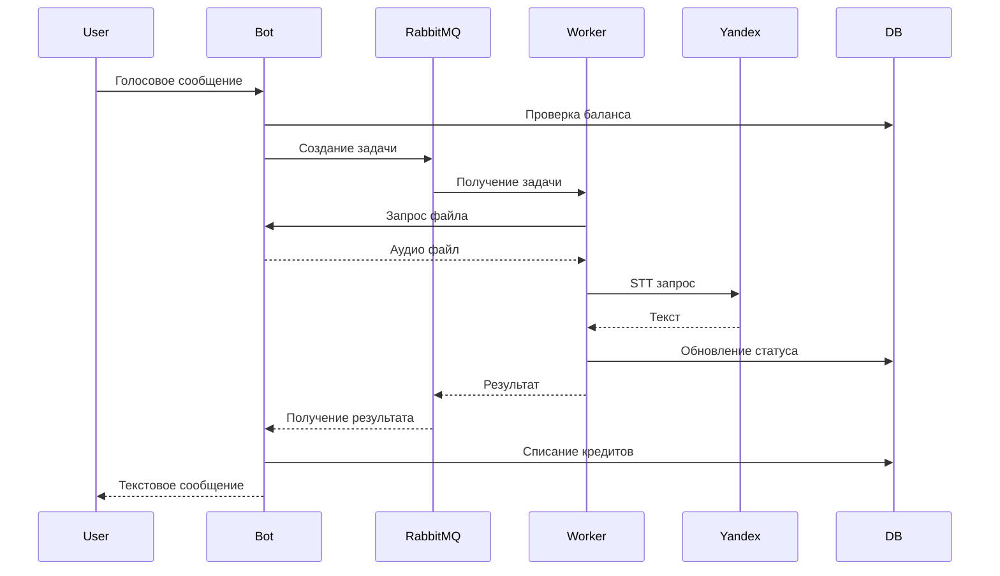

# Техническая документация ML Billing Service

## Архитектура системы



## Компоненты системы

### 1. Telegram Bot
- **Технология**: aiogram 3.x
- **Основные функции**:
  - Прием сообщений от пользователей
  - Отправка задач в RabbitMQ
  - Получение результатов от воркера
  - Управление балансом пользователей

### 2. Worker
- **Технология**: Python + aio_pika
- **Основные функции**:
  - Обработка задач из очереди
  - Взаимодействие с Yandex SpeechKit
  - Обновление статусов задач
  - Списание кредитов

### 3. База данных (PostgreSQL)
- **Таблицы**:
  ```sql
  -- Пользователи
  CREATE TABLE users (
      id SERIAL PRIMARY KEY,
      telegram_id BIGINT UNIQUE NOT NULL,
      username TEXT,
      role TEXT DEFAULT 'user',
      created_at TIMESTAMP DEFAULT CURRENT_TIMESTAMP
  );

  -- Балансы
  CREATE TABLE balances (
      user_id INTEGER PRIMARY KEY REFERENCES users(id),
      balance INTEGER NOT NULL DEFAULT 0,
      updated_at TIMESTAMP DEFAULT CURRENT_TIMESTAMP
  );

  -- Транзакции
  CREATE TABLE transactions (
      id SERIAL PRIMARY KEY,
      user_id INTEGER REFERENCES users(id),
      amount INTEGER NOT NULL,
      type TEXT NOT NULL,
      task_id TEXT,
      created_at TIMESTAMP DEFAULT CURRENT_TIMESTAMP
  );

  -- Задачи
  CREATE TABLE tasks (
      id TEXT PRIMARY KEY,
      user_id INTEGER REFERENCES users(id),
      type TEXT NOT NULL,
      status TEXT NOT NULL,
      payload TEXT,
      result TEXT,
      cost INTEGER,
      created_at TIMESTAMP DEFAULT CURRENT_TIMESTAMP,
      finished_at TIMESTAMP
  );
  ```

### 4. RabbitMQ
- **Очереди**:
  - `tasks` - основная очередь для задач
  - `reply_to` - динамические очереди для ответов

## Процессы обработки

### 1. Обработка текстового сообщения (TTS)



### 2. Обработка голосового сообщения (STT)



## Форматы сообщений

### 1. Задача в RabbitMQ
```json
{
    "user_id": 123456789,
    "type": "voice",
    "task_id": "123456789_123",
    "data": "AwADBAADbQADBQHYnyTTAAGjX4Ff"
}
```

### 2. Ответ от воркера
```json
{
    "status": "success",
    "message": "Распознанный текст",
    "type": "voice",
    "result_file": "path/to/file.mp3",
    "cost": 10
}
```

## Мониторинг

### 1. Prometheus метрики
- `task_processing_duration_seconds` - время обработки задачи
- `task_status_total` - количество задач по статусам
- `user_balance_total` - балансы пользователей
- `transaction_amount_total` - сумма транзакций

### 2. Grafana дашборды
- Общая статистика по задачам
- График балансов пользователей
- Мониторинг очередей RabbitMQ
- Ошибки и исключения

## Безопасность

### 1. Аутентификация
- Telegram ID пользователя
- Роли пользователей (admin, user, banned)

### 2. Авторизация
- Проверка баланса перед операциями
- Валидация входных данных
- Защита от двойного списания

## Масштабирование

### 1. Горизонтальное масштабирование
- Множество воркеров
- Балансировка нагрузки через RabbitMQ
- Репликация PostgreSQL

### 2. Вертикальное масштабирование
- Увеличение ресурсов контейнеров
- Оптимизация запросов к БД
- Кэширование результатов

## Отказоустойчивость

### 1. Обработка ошибок
- Повторные попытки при сбоях
- Таймауты на операциях
- Логирование ошибок

### 2. Восстановление
- Автоматический перезапуск контейнеров
- Восстановление очередей
- Бэкапы базы данных
